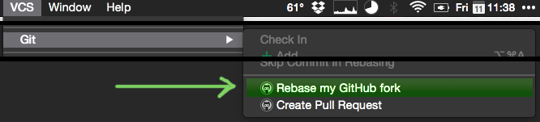

# Code Dojo for Javascript
Mega project

## Katas
1. [From Scratch!](01-from-scratch/)  
   Create a project that someone can checkout, install dependencies easily and be able to run a single command in the
   terminal to run the test suite. Learning objective: Project setup & debugging.
2. [Reverse Polish Notation](02-reverse-polish-notation/)  
   Implement reverse polish notation using baby stepped TDD. Learning objective: Take small steps when implementing.
3. [Vending Machine](03-vending-machine/)  
   Implement a vending machine against an acceptance test. Learning objective: writing clean unit tests that only use
   the implementation of the class under test.
4. [Bowling Scoring Open Closed](04-bowling-open-closed/)    
   Take in a series of scores for each ball a person bowls in a bowling game and return the resulting game score.
   Learning focus: Open/Closed principle.
5. [Reverse Polish Notation to Infix](05-rpn2infix/)  
   Implement reverse polish notation to infix using baby stepped TDD. Learning objective: Take small steps when implementing.
6. [Conditional-less Rock, Paper, Scissors](06-rock-paper-scissors/)    
   Implement rock, paper, scissors without using conditionals `if`'s etc. Learning objective: Replace conditional with polymorphism.
7. [Shopping checkout (Primitives)](07-shopping-checkout/)
   Implement the code for a supermarket checkout that calculates the total price of a number of items. Learning objective: primitive obsession.
8. [Shopping checkout (Flux)](08-shopping-checkout-flux)
   Implement the code for a supermarket checkout that calculates the total price of a number of items. Learning objective: Learn about flux and unidirectional data flow architecture.
9. [Coin recognition](09-coin-recognition)
   Implement the coin recognition from the vending machine kata but write isolated unit tests. Learning objective: unit test isolation, dependency injection, mocking.

## Forking
1. https://github.com/jtburke/js-code-katas/fork
2. https://help.github.com/articles/configuring-a-remote-for-a-fork/  
   `git remote add upstream https://github.com/jtburke/js-code-katas.git`
3. https://help.github.com/articles/syncing-a-fork/
```shell
# Checkout your master branch
git checkout master
# Merge changes from upstream master
git merge upstream/master
```
or  


## Installing dependencies
1. Navigate to mega project `cd ~/workspace/code-dojo-js`
2. Install dependencies `npm install`
3. Open desired kata `cd ./xx-kata-name`
4. Install dependencies `npm install`
5. Run Tests `npm test`

## Style guide
https://github.com/airbnb/javascript  
http://eslint.org/

## IntelliJ/Jetbrains
There should be some runnable configs for mocha in intellij. The project was created using IntelliJ 13 so it may or may
not work for you. If you'd like to create your own mocha configs:  

Extra Mocha Options: ```"test/**/*Test.js" --compilers js:babel/register --require "test/helpers/helper.js"```

## Testing Framework
The test framework is [mocha](http://mochajs.org/) and the assertion library is [chai](http://chaijs.com/),
[sinon](http://sinonjs.org/) and [sinon-chai](http://sinonjs.org/) have also been included for you. There is a
helper.js file that includes mocha, chai, sinon and sinon-chai and sets up chai with the should style of assertions
to save you having to do it in each test file.

### There's some nice cheat sheets here:
http://ricostacruz.com/cheatsheets/mocha.html  
http://ricostacruz.com/cheatsheets/chai.html  
http://ricostacruz.com/cheatsheets/sinon-chai.html
